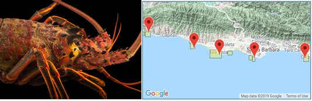

<br>
```{r setup, include=FALSE, warning=FALSE}
```

```{r include=FALSE, warning=FALSE}
# Attach required packages
library(tidyverse)
library(janitor)
library(here)
library(hrbrthemes)
library(viridis)
library(ggthemes)
library(paletteer)
library(DT)
library(plotly)
library(expss)
library(kableExtra)
```
#### **Introduction**
The California Spiny Lobster (*Panulirus interruptus*) is a keystone species within nearshore kelp forest ecosystems along the Southern California coast, and a target of both commercial and recreational fisheries. [1] Due to its value as a natural resource, the California Spiny Lobster has received state protection for over a century. [1] On January 1, 2012, California Fish and Game established two Marine Protection Areas (MPA), Naples and Isla Vista, as part of a greater Network of Marine Protected Areas. [2] In spring 2012, the California Department of Fish and Wildlife began developing a Fishery Management Plan (FMP) under the Marine Life Management Act, resulting in the publication of the California Spiny Lobster FMP in spring 2016. [1] The Santa Barbara Coastal Long-Term Ecological Research (SBC LTER) program was established in 2000 to examine the effect of fishing on kelp forest ecosystem dynamics. The SBC LTER program uses interdisciplinary approaches to study the ecology and dynamics of coastal kelp forest communities in nearshore waters along the coast of southern California. [2] From 2012 to 2018, the SBC LTER program collected data on California Spiny Lobster abundance and size in the nearshore waters of the Santa Barbara Channel. The following report will compare California Spiny Lobster size and abundance data from 2012 to 2018 across five SBC LTER study sites, representing MPA sites in dark grey and non-MPA sites in teal.

<br>

{ width=100% }***Figure 1.** California Spiny Lobster (left) and spatial coverage of SBC LTER data collection sites (right).
Credit: [Joel Sartore](https://www.joelsartore.com/inv002-00050/) and [SBC LTER EDI Data Portal Site](https://portal.edirepository.org/nis/mapbrowse?scope=knb-lter-sbc&identifier=77&revision=newest)*

<br>

#### **Data and Methods**
Data for Caifornia Spiny Lobster size and abundance were collected through SBC LTER program field studies from 2012-2018. Size and abundance data were part of a larger study which also collected data regarding fishing effort at these sites. Each year in August and September, prior to fishing season, abundance and size data were collected by divers. Sampling continues to take place annually. Data collection locations included two MPA sites (Naples and Isla Vista) and three non-MPA sites (Arroyo Quemado, Mohawk and Carpinteria). The geographic coordinates of these sites can be found on the [SBC LTER EDI Data Portal Site](https://portal.edirepository.org/nis/mapbrowse?scope=knb-lter-sbc&identifier=77&revision=newest) under the Spatial Coverage map. Please reference [metadata](https://portal.edirepository.org/nis/metadataviewer?packageid=knb-lter-sbc.77.3) for more information on collection methods and study site location. Annual changes in California Spiny Lobster abundance by site, as well as size distribution shifts in 2012 and 2018, were explored visually. Mean lobster sizes (mm) at MPA verses non-MPA sites for years 2012 and 2018 were compared visually and by paired, two-sample t-tests (α = 0.05). Effect size was reported using Cohen's d. This report presents analysis and figures exclusively prepared using .R software version 3.6.1.

<br>

#### **Results**

<br>

```{r include=FALSE, warning=FALSE}
# Read in csv titled "lobster_abundance_sbc_lter.csv"

lobster_data <- read_csv("lobster_abundance_sbc_lter.csv", na = "-99999")
```

```{r include=FALSE, warning=FALSE}
# Clean data variable titles using janitor clean_names()

lobster_clean <- lobster_data %>%
  clean_names()

# Mutate a new column to reflect the full mdy in proper formate as well as isolating days using lubridate.
lobster_date <- lobster_clean %>% 
  mutate(date_new = lubridate::ymd(date)) %>%
  mutate(day_new = lubridate::day(date)) %>%
  select(-date) %>%
   mutate(site_2 = site) %>%
   mutate(mpa_affil = case_when(site %in% c("CARP", "MOHK", "AQUE") ~ "non-MPA",
                               TRUE ~ "MPA"))


```


```{r echo=FALSE, warning=FALSE}

# Results A: Visually explore changes in annual lobster abundance (counts) by site. After grouping observations to find lobster counts for each year, create a finalized data visualization (no modeling/stats needed) showing changes in annual lobster abundance at the five sites over time. You should decide how to best present the data. Make your data visualization correct, clear, responsible, and professional. Details matter (e.g. is it easier to read a legend or label lines directly? How can I designate between MPA and non-MPA sites? And many more decisions!). Add a figure caption below the graph.

lob_abundance <- lobster_date %>%
    select(year, site, count, mpa_affil) %>%
  group_by(year, site, mpa_affil) %>%
  summarise(
    total_count = sum(count))
# Create a second version of Site to lay over as a backdrop for the graphs. 
lob_site2 <- lobster_date %>%
  select(-site) %>%
  group_by(year, site_2) %>%
  summarise(
    total_count = sum(count)
  )
# create a line graph with facet wrap.  Make the color of lines represent your sites.  Manually fill the color for MPA vs non MPA sites. 

lob_abund_plot <- ggplot(lob_abundance, aes(x=year, y=total_count)) +
    geom_line(data = lob_site2, aes(group=site_2), color="grey", size=0.5, alpha=0.7) +
    geom_line(aes(color=site), size=1.2 ) +
    theme_ipsum() +
    theme(
      legend.position="none",
      plot.title = element_text(size=14)
    ) +
    ggtitle("Total Lobsters Counted at Sites in SB County") +
    facet_wrap(~site) +
  scale_color_manual(values=c("#69b3a2", "#69b3a2", "darkslategrey", "#69b3a2", "darkslategrey")) +
  labs(x = "Year",
       y = "Lobster Count")


```

```{r echo=FALSE, warning=FALSE, fig.cap="***Figure 2.** Graphs visualize fluctuations in lobster abundance from 2012-2018 across SBC LTER study sites within the Santa Barbara Channel. MPA study sites include Naples (NAPL) and Isla Vista (IVEE). Non-MPA sites include Arroyo Quemado (AQUE), Mohawk (MOHK), and Carpinteria (CARP).*"}

lob_abund_plot +  theme(
    plot.title=element_text( hjust=0.5, vjust=0.5, face='bold'))

```
<br>
**A. Changes in annual California Spiny Lobster abundance for all Santa Barbara Coastline sites:**

As of December 2009, the IUCN Red List of Threatened Species has deemed the California Spiny Lobster a species of Least Concern, with a stable population trend. [3] The California Spiny Lobster abundance data collected by the SBC LTER program examines a small percentage of the total California Spiny Lobster population across the species' geographic range. However, general trends in this data provide evidence of stable, and in some cases increasing, populations within the nearshore kelp forests of the Santa Barbara Channel. Despite the fact that declines in abundance are observed in Carpenteria from 2017-2018, and Naples and Isla Vista from 2015-2016, all study sites have experienced some level of overall increase in California Spiny Lobster abundance from 2012 to 2018, with Isla Vista, an MPA site, displaying the greatest increase in California Spiny Lobster abundance from 2012-2018.   
<br>
```{r echo = FALSE, warning=FALSE, fig.cap="***Figure 3.** Graphs visualize California Spiny Lobster size distribution shifts from the start (2012) and the end (2018) of the data collection period examined in this mini-report. These shifts are examined for all SBC LTER study sites.*"}
# Results B. Visually explore lobster size distribution shifts by comparing lobster sizes in 2012 and 2018. Visually explore the size distributions for lobsters observed at the 5 different sites in 2012, and in 2018 (i.e. you will have a total of 10 size distributions shown: for each of the 5 sites, one for 2012 and one for 2018). Make a finalized graph that clearly and professionally shows community size distributions at each site in the 2 years, allowing the reader to easily interpret distribution shifts. Add a figure caption below the graph. 

lobster_tidy <- lobster_date %>%
  tidyr::uncount(count) %>%
  filter(year == "2012" | year == "2018") %>%
  group_by(year, site, size_mm)

lobster_tidy2 <- lobster_date %>%
  tidyr::uncount(count) %>%
  filter(year == "2012" | year == "2018") %>%
  select(-site) %>%
  group_by(year, site_2, size_mm)

lob_dense <- ggplot(lobster_tidy, aes(x = size_mm)) +
  geom_density(data = lobster_tidy2, aes(group = site_2), color = "grey", fill = "grey", alpha = 0.5) +
  geom_density(aes(fill = site, color = site), alpha=.4) +
  theme_ipsum() +
  facet_grid(site ~ year) +
  labs(x = "Size (mm)",
       y = "Density") +
   ggtitle("Lobster Size by Site: 2012 and 2018 Comparison") +
  scale_color_manual(values=c("#69b3a2", "#69b3a2", "darkslategrey", "#69b3a2", "darkslategrey")) +
  scale_fill_manual(values=c("#69b3a2", "#69b3a2", "darkslategrey", "#69b3a2", "darkslategrey")) +
  theme(
      legend.position="none",
      plot.title = element_text(size=14),
      strip.text.y = element_text(size = 8)
    ) 

lob_dense +
   theme(
    plot.title=element_text(hjust=0.5, vjust=0.5, face='bold'))

```
<br>
**B. Shifts in community size structure for all Santa Barbara Coastline sites in years 2012 and 2018:** 

California Fish and Game establishes MPA to conserve natural resources, both for the sake of ecosystem health and for recreational use. [2] The California Spiny Lobster receives further protection through fishing restrictions imposed by the California Department of Fish and Wildlife. [4] These restrictions prohibit the collection of lobsters below a minimum size limit, as an individual lobster's size indicates the likelihood that it was able to reproduce at least once that season. [4] General trends in this data provide evidence of a positive shift in community size structure when comparing community size observed in 2012 to that observed in 2018 across all study sites. Interestingly, the largest positive shifts occur in MPA sites. While simple visualization of shifts in California Spiny Lobster community size structure can provide some information regarding overall trends in community size structure for 2012 and 2018, this evidence could be strengthened by further modeling and statistical analysis. These tests are included in section C.
<br>
```{r echo=FALSE, warning=FALSE, fig.cap="***Figure 4.** Graphs visualize mean size of California Spiny Lobsters in 2012 and 2018, comparing mean lobster size at MPA sites to mean lobster size at non-MPA sites for these specific years.*"}
# Results C. Compare mean lobster sizes at MPA vs. non-MPA sites in 2012 and 2018. Here, for each year (2012 and 2018) consolidate the size observations into only two groups: MPA and non-MPA lobsters. 

lobster_name <- lobster_tidy %>% 
  mutate(mpa_affil = case_when(site %in% c("CARP", "MOHK", "AQUE") ~ "non-MPA",
                               TRUE ~ "MPA")) %>%
  group_by(mpa_affil, year, size_mm)
  

lobster_box <- ggplot(lobster_name, aes(x = mpa_affil, y = size_mm, group = mpa_affil, fill = mpa_affil))

lob_boxplot <- lobster_box +
  geom_boxplot(alpha = .7) +
    guides(fill = "none") +
    theme_ipsum() +
  facet_wrap(~year) +
   scale_color_paletteer_d(awtools, a_palette) +
  scale_fill_paletteer_d(awtools, a_palette) +
    labs(x = "MPA Affiliation",
       y = "Mean Size (mm)") +
       ggtitle("Lobster Mean Size: 2012 and 2018 Comparison")
  
lob_boxplot +
   theme(
    plot.title=element_text( hjust=0.5, vjust=0.5, face='bold'))
```
<br>
```{r echo=FALSE, warning=FALSE}
lobster_summary <- lobster_name %>%
  select(mpa_affil, size_mm, year) %>%
  group_by(mpa_affil, year) %>%
  summarize(
    mean_size = mean(size_mm, na.rm = TRUE),
    sd_size = sd(size_mm, na.rm = TRUE),
    sample_n = n()
  )

kable(lobster_summary, col.names = c("MPA Affiliation",
                           "Year",
                           "Mean Size",
                           "SD Size", "Sample n"),
        caption = 
            "Figure 5. The table below includes the means, standard deviations, and sample sizes for MPA and non-MPA sites in 2012 and 2018.") %>% 
  kable_styling(bootstrap_options = c("striped", "hover"))
  

```

```{r include=FALSE, , warning=FALSE}
# Sample size (MPA vs non-MPA):
mpa_filter <- lobster_name %>%
  filter(mpa_affil == "MPA")

nonmpa_filter <- lobster_name %>%
  filter(mpa_affil == "non-MPA")

n_mpa <- sum(!is.na(mpa_filter$size_mm))
n_nonmpa <- sum(!is.na(nonmpa_filter$size_mm))

# Means (MPA v. nonMPA):
mean_mpa <- mean(mpa_filter$size_mm, na.rm = TRUE)
mean_nonmpa <- mean(nonmpa_filter$size_mm, na.rm = TRUE)

# Medians (MPA v. non MPA):
median_mpa <- median(mpa_filter$size_mm, na.rm = TRUE)
median_nonmpa <- median(nonmpa_filter$size_mm, na.rm = TRUE)

# Standard deviations (immediate v. 2 min flushing):
sd_mpa <- sd(mpa_filter$size_mm, na.rm = TRUE)
sd_nonmpa <- sd(nonmpa_filter$size_mm, na.rm = TRUE)
```

```{r include=FALSE, warning=FALSE}
# Welch two T test

mpa_sample <- lobster_name %>%
  filter(mpa_affil == "MPA") %>%
  pull(size_mm)

t.test(mpa_sample)

nonmpa_sample <- lobster_name %>%
  filter(mpa_affil == "non-MPA") %>%
  pull(size_mm)

t.test(nonmpa_sample)

mpa_nonmpa_ttest <- t.test(mpa_sample, nonmpa_sample)

mpa_nonmpa_ttest


```
<br>

**C. Mean lobster sizes at MPA verses non-MPA sites in 2012 and 2018:**

Mean lobster sizes (mm) measured at the protected site (MPA) samples (`r round(mean_mpa, 2)` $\pm$ `r round(sd_mpa, 2)`, n = `r n_mpa`) differed significantly from non protected sites (non-MPA) samples for both 2012 and 2018, and between the years of 2012 and 2018 (`r round(mean_nonmpa, 2)` $\pm$ `r round(sd_nonmpa, 2)`, n = `r n_nonmpa`) by a paired two-sample t-test (t(`r round(mpa_nonmpa_ttest$parameter, 2)`) = `r round(mpa_nonmpa_ttest$statistic, 2)`, *p* < 7.708e-11). This hypothesis is strengthened by a Cohen's d value of approximately 0.29, indicating a small effect size. 

<br>

```{r, include=FALSE, warning=FALSE}
# Or we could use the existing `effsize::cohen.d()` function instead of creating our own. Let's use it here to check that results match for our function and the `cohen.d` function.

# 


lob_cohen <- effsize::cohen.d(mpa_sample, nonmpa_sample, na.rm = TRUE)


# Then in our report, we would want to include the actual means of the samples, and the effect size, possibly the confidence interval for each, and then the *least interesting thing* shoud be the statement of significance associate with our t-test.
```

```{r echo=FALSE, warning=FALSE}
lobster_density <- lobster_name

lob_affil <- ggplot(lobster_density, aes(x=size_mm, group = mpa_affil)) +
    geom_density(aes(color = mpa_affil, fill = mpa_affil), alpha=0.8) +
    ggtitle("Size of Lobsters at MPA Sites vs. Non-MPA Sites") +
  theme_ipsum() +
  facet_wrap(~ year) +
  scale_color_paletteer_d(awtools, a_palette, guide = FALSE) +
  scale_fill_paletteer_d(awtools, a_palette, name = "MPA Affiliation")

lob_affil +
   theme(
    plot.title=element_text( hjust=0.5, vjust=0.5, face='bold')
    )
  

```

<br>

```{r warning=FALSE, include=FALSE}
lobster_ysite <- lobster_date %>%
  count(year, site)


lob_heat <- ggplot(data = lobster_ysite, aes(x = year, y = site)) +
  geom_tile(aes(fill = n)) +
  scale_fill_viridis(discrete=FALSE, option="cividis")

lob_heat
        
```

#### **Summary**

<br>

- All study sites displayed overall population stability between 2012 and 2018, with both MPA sites displaying an increase in abundance from 2017-2018 (Figure 2)
- Mean size of California Spiny Lobsters found in MPA sites increased between 2012 and 2018 (Figure 4)
- Mean size of California Spiny Lobsters found in non-MPA sites decreased between 2012 and 2018 (Figure 4)

<br>

#### **References**
[1] “California Spiny Lobster Fishery Management Plan.” [Online]. Available: https://www.wildlife.ca.gov/Conservation/Marine/Lobster-FMP. [Accessed: 16-Nov-2019].

[2] “Santa Barbara Coastal LTER.” [Online]. Available: https://sbclter.msi.ucsb.edu/. [Accessed: 16-Nov-2019].

[3] “The IUCN Red List of Threatened Species,” IUCN Red List of Threatened Species. [Online]. Available: https://www.iucnredlist.org/en. [Accessed: 16-Nov-2019].

[4]“Current 2019-2020 Recreational Lobster Fishing Information.” [Online]. Available: https://www.wildlife.ca.gov/Conservation/Marine/Invertebrates/Lobster. [Accessed: 17-Nov-2019].

